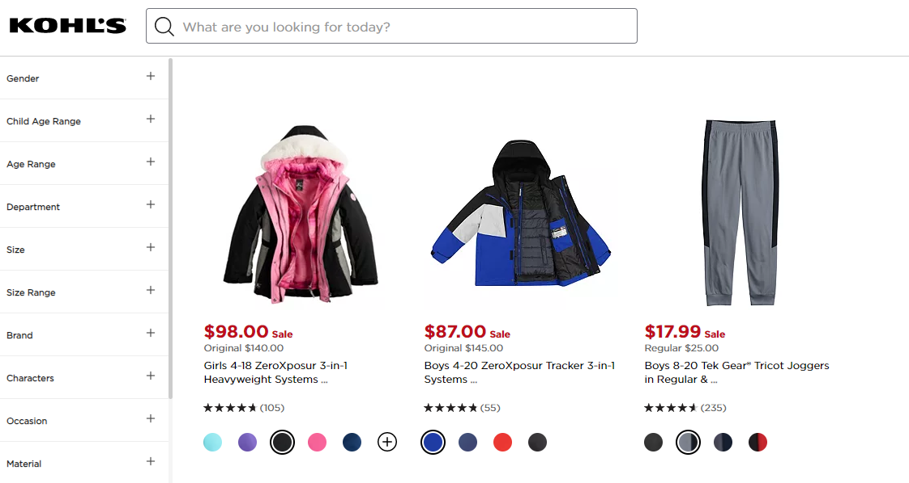
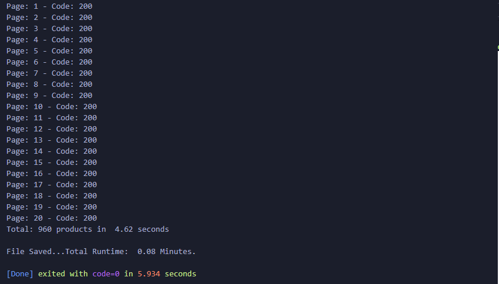
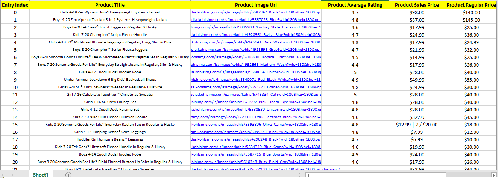

# Asynchronous Web Scraper :
`kohls-scraper` is an asynchronous **python** web scraper designed to **fetch** and **parse** product data from kohls.com using these libraries :

## Python Libraries

- [ ] **aiohttp**
- [ ] **asyncio**
- [ ] **pandas**
- [ ] **json**
- [ ] **sleep**
    - [ ] **perf_counter**

 

  
 

 
 
 Using the power of **asynchronous programming**, this script can achieve high-speed execution :
 
  

  
 

 
  
  At the end all the data is collected, processed and saved to an **excel sheet** :
  

  
 

 
